# C2C Platform — High-Level Design

## Current State (Problem)

Six services exist but operate as silos. They share the same Supabase database but have no orchestrated connection to the Next.js platform or to each other. Students, TPOs, and employers interact with the web app — but the AI intelligence layer (job matching, profile optimization, market data) is only accessible by running CLI scripts manually.

---

## Proposed Architecture

The core idea: **Supabase is already the common data bus.** The integration strategy is to wire each service as a background worker or API microservice that reads/writes through Supabase, triggered by platform events (student completes assessment, employer posts a job, TPO requests a placement report).

---

## Block Diagram

```mermaid
graph TB
    subgraph WEB["🌐 Next.js Web Platform (C2C)"]
        direction TB
        STU["🎓 Student Dashboard\n/dashboard/:id"]
        TPO["🏫 TPO Dashboard\n/tpo-dashboard/:id"]
        EMP["🏢 Employer Portal\n/employer"]
        ADM["⚙️ Admin\n/admin"]
        ASSESS["📝 Assessment Engine\n/assessment"]
        ONBOARD["🚀 Onboarding\n/onboard"]
    end

    subgraph SUPA["🗄️ Supabase (Shared Data Backbone)"]
        direction LR
        DB[("PostgreSQL\nstudents · institutions\nemployers · leads\nassessments · jobs")]
        AUTH["Auth\nJWT + Roles"]
        STORE["Storage\nPortfolios · CVs\nOptimized READMEs"]
        RT["Realtime\nEvent Bus"]
    end

    subgraph WORKERS["⚙️ Background Workers / Microservices"]
        direction TB

        subgraph JID["job-intel-desk  (FastAPI)"]
            SCOUT["🔍 Scouts\nGreenhouse · Ashby\nHN · GitHub · Lever"]
            SCORE["📊 Scoring Engine\nLLM fit-rank vs\ncandidate profile"]
            GEN["✍️ Generator\nCV · Cover Letter\nOutreach email"]
        end

        subgraph MS["market-scout  (Python worker)"]
            SCRAPE["🕷️ Job Scrapers\nHN Hiring · RemoteOK"]
            AISUM["🤖 AI Summariser\nRole classification\n& enrichment"]
        end

        subgraph AR["agent-recruiters  (Agent Harness)"]
            PSYCH["🧠 Psychologist\nOrdeal evaluator"]
            NARR["📖 Narratologist\nProfile story crafter"]
            ANTH["🔬 Anthropologist\nCultural fit analyser"]
            RECRUIT["🤝 Recruitment Specialist\nOutreach + campus ops"]
        end

        subgraph BO["brand-optimizer  (Agent)"]
            LI["💼 LinkedIn\nOptimiser"]
            PORT["🗂️ Portfolio\nGenerator"]
        end

        subgraph GO["git-optimizer  (Agent)"]
            README["📄 README\nEngineer"]
            AUDIT["🔎 Codebase\nAuditor"]
        end

        subgraph C2C["campus-to-corporate  (CLI / Agent)"]
            APPLY["📨 Auto-Apply\nEngine"]
            INTPREP["🎯 Interview\nPrep Agent"]
        end
    end

    subgraph TRIGGER["🔔 Trigger Layer (Supabase Functions + Webhooks)"]
        T1["on: assessment_completed\n→ fire agent-recruiters ordeal"]
        T2["on: student_onboarded\n→ fire brand/git optimizers"]
        T3["on: employer_job_posted\n→ fire market-scout + scoring"]
        T4["on: lead_approved_by_student\n→ fire c2c auto-apply"]
        T5["scheduled: daily 6am\n→ fire market-scout scrape"]
    end

    %% Web → Supabase
    STU <-->|"reads/writes via\nauthFetch + RLS"| SUPA
    TPO <-->|"reads/writes via\nauthFetch + RLS"| SUPA
    EMP <-->|"reads/writes via\nauthFetch + RLS"| SUPA
    ADM <-->|"reads/writes via\nauthFetch + RLS"| SUPA
    ASSESS -->|"saves AssessmentResult\n+ DimensionScores"| DB
    ONBOARD -->|"saves Student\n+ portfolio stub"| DB

    %% Supabase → Triggers
    DB -->|"row-level hooks"| TRIGGER

    %% Triggers → Workers
    T1 --> AR
    T2 --> BO
    T2 --> GO
    T3 --> MS
    T3 --> JID
    T4 --> C2C
    T5 --> MS

    %% Workers → Supabase (write back)
    JID -->|"saves scored leads\nto leads table"| DB
    MS -->|"upserts raw job\nlistings"| DB
    AR -->|"writes DevelopmentReport\n+ ordeal scores"| DB
    BO -->|"uploads optimised\nPortfolio to Storage"| STORE
    GO -->|"uploads optimised\nREADMEs to Storage"| STORE
    C2C -->|"writes application\nstatus to leads"| DB

    %% Realtime pushes back to web
    RT -->|"push: new leads ready\nnew report ready"| STU
    RT -->|"push: cohort activity\nplacement alerts"| TPO
    RT -->|"push: new candidates\nmatched"| EMP
```



---

## Data Flow Per User Journey

### Journey 1 — Student Onboards

```
Student signs up → /onboard saves profile to Supabase
    → Trigger: student_onboarded
        → brand-optimizer: reads LinkedIn/GitHub URLs from profile
                           generates optimised Portfolio JSON → saves to Storage
        → git-optimizer:   audits GitHub repos, engineers READMEs → saves to Storage
    → Student dashboard shows "Profile optimisation complete" via Realtime
```

### Journey 2 — Student Completes Assessment

```
Student completes /assessment → AssessmentResult + DimensionScores saved
    → Trigger: assessment_completed
        → agent-recruiters (Psychologist): reads responses, runs ordeal evaluation
        → agent-recruiters (Narratologist): crafts profile narrative
        → agent-recruiters (Anthropologist): cultural fit scoring
        → All three write DevelopmentReport to Supabase
    → Dashboard surfaces placement-readiness score + feedback
```

### Journey 3 — Employer Posts a Job

```
Employer creates job posting → job saved to Supabase
    → Trigger: employer_job_posted
        → job-intel-desk Scoring Engine: matches job against all assessed students
                                         ranks by fit score, saves to leads table
        → market-scout: enriches with external market data (similar roles, salary bands)
    → Employer dashboard shows ranked candidate matches
    → Matched students get Realtime notification: "New opportunity matched"
```

### Journey 4 — Student Approves a Lead

```
Student sees lead on dashboard → clicks "Apply"
    → Trigger: lead_approved_by_student
        → job-intel-desk Generator: drafts tailored CV + cover letter from
                                     student portfolio + job description
        → campus-to-corporate auto-apply: submits application to ATS
        → contact_lookup: finds hiring manager email, drafts outreach
    → Lead status updates to "Applied" via Realtime
    → TPO dashboard reflects updated placement pipeline
```

### Journey 5 — Daily Market Sweep (Scheduled)

```
Cron: daily 6am
    → market-scout: scrapes HN Hiring, RemoteOK, GitHub Jobs
    → job-intel-desk Scouts: scrapes Greenhouse, Ashby, Lever, Reddit
    → All new roles upserted to Supabase with AI-enriched metadata
    → Scoring Engine runs against all active student profiles
    → New matched leads appear on student dashboards via Realtime
```

---

## Integration Patterns Per Service

| Service | Integration Type | Trigger | Writes To |
|---------|-----------------|---------|-----------|
| **job-intel-desk** | FastAPI microservice (already has HTTP server) | Employer job posted / daily cron | `leads`, `jobs` tables |
| **market-scout** | Python cron worker | Daily schedule + job posted event | `jobs` table (raw listings) |
| **agent-recruiters** | Supabase Edge Function (invoke agent via HTTP) | Assessment completed | `development_reports` table |
| **brand-optimizer** | Edge Function / GitHub Action | Student onboarded | `storage/portfolios/` |
| **git-optimizer** | Edge Function / GitHub Action | Student onboarded | `storage/readmes/` |
| **campus-to-corporate** | CLI invoked by Edge Function | Lead approved | `leads.status` |

---

## What Needs to Be Built

### Phase 1 — Data Bus (lowest effort, highest ROI)
- [ ] Define Supabase webhook endpoints for the 5 triggers above
- [ ] Add `PORTFOLIO_SCHEMA.json` as the canonical contract between services and the web app
- [ ] Expose `job-intel-desk` FastAPI on a port; add `NEXT_PUBLIC_JOB_INTEL_URL` to env

### Phase 2 — Worker Wiring
- [ ] Wrap `market-scout/scraper/main.py` as a Supabase Edge Function or containerise it
- [ ] Wrap `agent-recruiters` ordeal agents as callable HTTP endpoints
- [ ] Add `brand-optimizer` and `git-optimizer` as triggered background jobs

### Phase 3 — Realtime UI
- [ ] Add `supabase.channel().on('postgres_changes')` listeners in Student/TPO dashboards
- [ ] Surface AI-generated reports and matched leads without page refresh
- [ ] Add "Apply Now" flow that triggers campus-to-corporate auto-apply

---

## Key Principle

> **Don't rebuild — rewire.** Every service already works. The integration is entirely in the trigger layer and the shared Supabase schema. The web app just needs to listen for the results.
